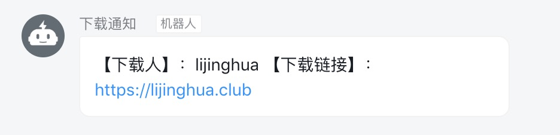

## 钉钉通知 Go

```go
func SendDingTalk(UserName, DownloadUrl string) {
	access_token := "u token"
	url := "https://oapi.dingtalk.com/robot/send?access_token="+access_token
	method := "POST"
	}
```


### demo



